真实世界的全栈工程师的十八项必备技能
===

> 30分钟了解《Growth：Web开发思想》

在《Growth：Web开发思想》出版以前，请参考开源电子书《[Growth：全栈增长工程师实战](https://github.com/phodal/growth-in-action)》与《[Growth: 全栈增长工程师指南](https://github.com/phodal/growth-ebook)》。

引言：精益与全栈
---

在埃里克·莱斯的《精益创业》中提到了下面的精益环路：

而精益的思想是**在生产过程中减少的浪费**，在软件开发的过程中最容易造成浪费的就是：

 1. 业务人员对于市场的理解不一致，导致做不出用户所需要的产品。这部分可以通过精益环路来提高。
 2. 开发人员对于需求的了解不清晰，导致结果与业务人员所需要的不一致。这部分则可以通过改善流程来解决。
 3. 开发人员与第三方开发商的沟通问题。呵呵。
 4. 团队内部的沟通与集成问题

当我们讨论全栈的时候，我们就是想解决沟通带来的时间浪费问题。沟通不畅最好的例子就是**巴别塔**：

而前后端分离带来的第一个痛点就是：集成。如果你和我们一样采用敏捷开发流程的话，你就可以很容易看到这个问题了：

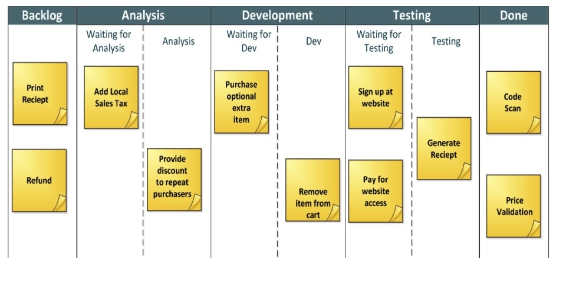

当你已经完成前端功能的时候，后端还没完成。你可能就需要开发额外的业务卡，最后等后端完成时再回来集成。尽管我们会在实践上使用基于契约的开发模式：

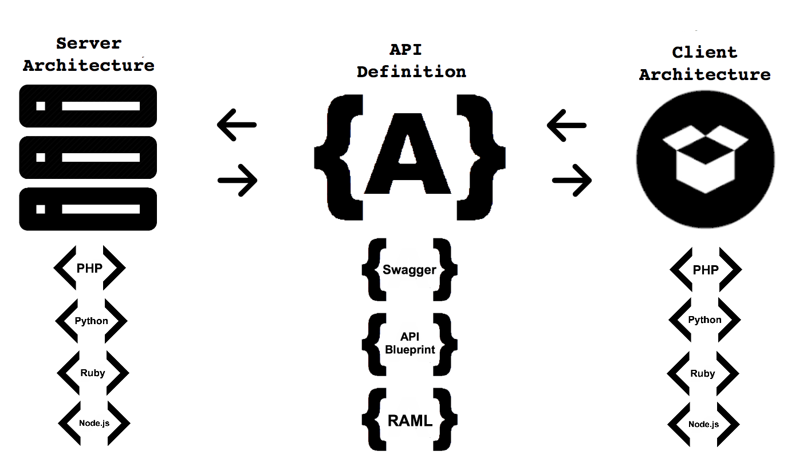

但是一旦我们发现最初的契约不符合我们要求的时候，我们就需要重新修改前后端。这时对接这个 API 的人，就需要放下手头的工作来更新这个 API。

尽管你们已经采用了迭代式开发，但是前后端分离在一夜又将软件开发放到了解放前的瀑布流：

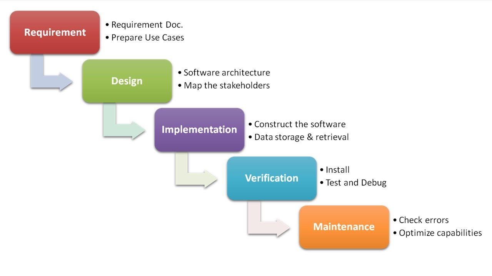

在我最初的项目里，我们采用全功能团队的模式，主要是因为团队小——小的团队一遇到一两个人请假，就可能会出现风险。尽管后来我们的团队从6个人变成了12个人，我们仍然采用这种模式。我们采用结对编程是一个方面，另外一个方面是：团队里就需要有一个人来专门解决各种大小事务。如持续集成有问题、自动构建出错、测试有问题等等，没有人愿意专门去做这样的事。

本文总结了正在撰写的《Growth：Web开发思想》里提出的一系列实践，为18个步骤:

 - Tasking，即将目标切换成一个个小的任务，而这些任务尽可能的遵循 SMART 原则，如这里的 18 个步骤。
 - Setup，搭建开发所需要的基本环境，并尽最大能力地去练习 IDE 及操作系统等等日常工具的使用。
 - UI Prototype，可以使用简单的使用 UI 工具来创建 Web 页面的原型。
 - Technology Decision，能根据我们的能力以及项目的需要，选择合适的工具。
 - hello, world -> Boilerplate，能自己搭建或者寻求一些比较好的 应用模板。
 - Build Pipeline，可以设计出整个应用的构建流程，如依赖包管理、运行服务、执行语法检测、运行测试等等。
 - Coding，至少能使用两门以上的语言，一门是 JavaScript，一门是编译语言。光只有动态语言，无法让你理解计算机语言的。
 - Testing，可以编写单元测试、服务测试、UI自动化测试。
 - Deploy，可以完整将应用部署到服务器上。
 - Auto Deploy，要会在本地敲个命令，自动部署新版本的应用到服务器上。
 - Analytics，不仅仅要知道很多用户喜欢这个功能，还要知道为什么。
 - Optimization，即要知道程序中哪里用得多，又要能对代码进行优化。
 - Continuous Intergration，除了学会使用持续集成工具，你还要学习什么是持续集成。
 - Continuous Delivery，就是缺少一个在持续集成与自动化部署之间的按钮。
 - Continuous Deployment，将持续交付的按钮变成自动化就完了？你要改变的不是代码本身 ，还有组织架构。
 - SEO / ASO， 将用户导向你的应用是一门艺术。
 - Retro，由输出结果来改入输入流程，这才能提高组织和自身的水平。
 - Refactor，你以为只有代码和架构可以重构么？

任务切分
---

> 即将目标切换成一个个小的任务，而这些任务尽可能的遵循 SMART 原则，如这里的 18 个步骤。

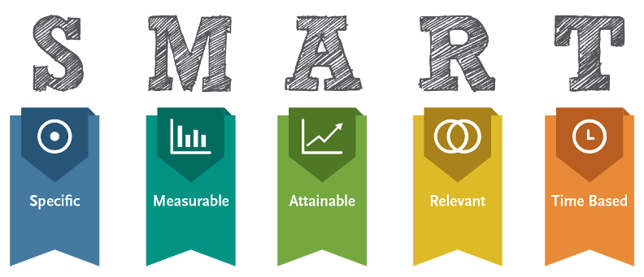

 - 具体的
 - 可度量的
 - 可实现的
 - 相关的
 - 时间可控的

环境搭建
---

> 搭建开发所需要的基本环境，并尽最大能力地去练习 IDE 及操作系统等等日常工具的使用。

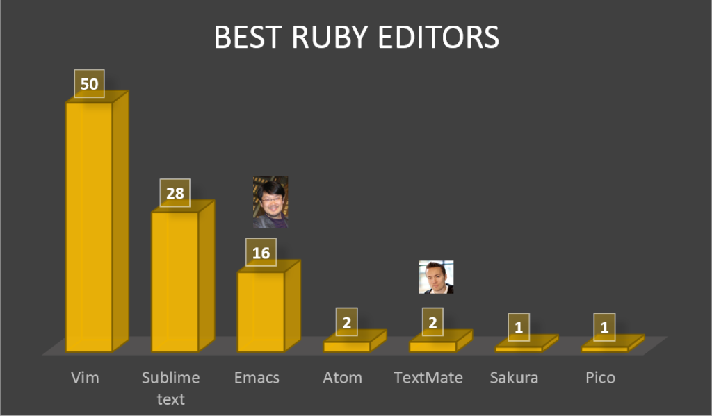

至少达到下面的基本要求：

 - 有一个上手的 IDE 或者 编辑器
 - 熟练使用包管理
 - 使用快速启动工具
 - 有一个好的命令行工具
 - 熟练使用Git 或者 SVN

UI原型
---

> 可以使用简单的使用 UI 工具来创建 Web 页面的原型。

你应该会下面的这些内容：

 - 使用 UI 工具来设计原型
 - HTML + CSS

技术选型
---

> 能根据我们的能力以及项目的需要，选择合适的工具。

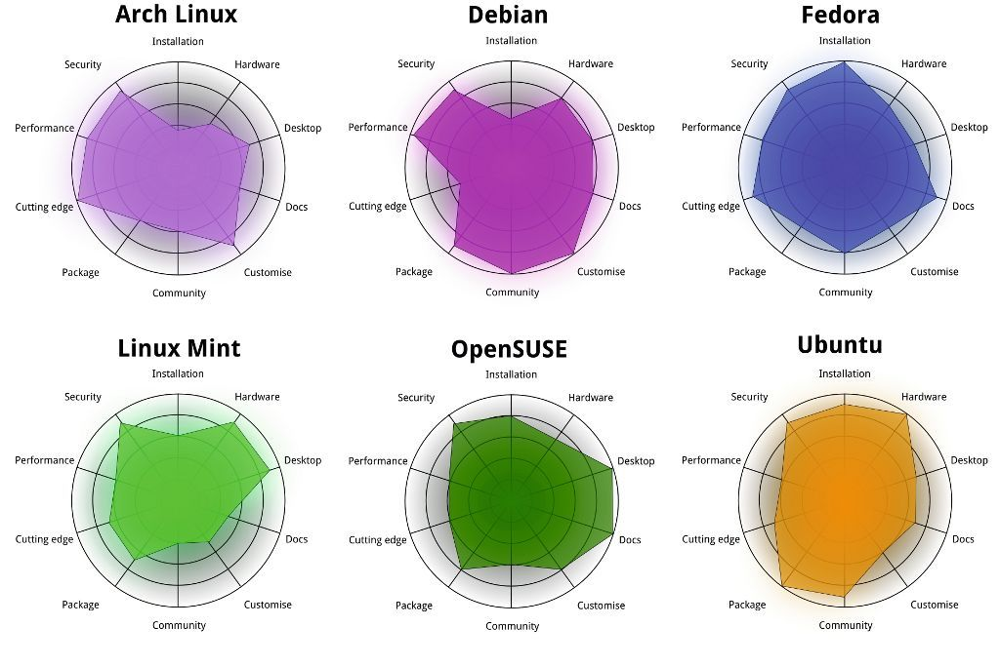

至少要有：

 - 后台MVC框架
 - 数据库
 - UI 框架

hello, world
---

> 能自己搭建或者寻求一些比较好的应用模板

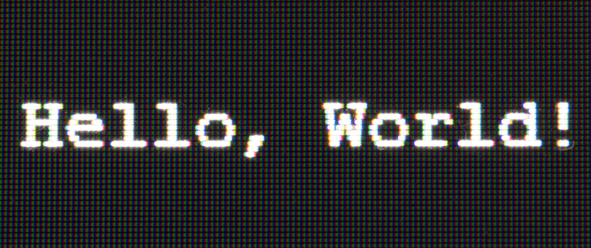

因此，你应该到 Web 前后端有一个明确的概念。

构建流
---

> 可以设计出整个应用的构建流程，如依赖包管理、运行服务、执行语法检测、运行测试等等

你需要设计出这样的一个系统：

 - 能帮助你提高开发效率
 - 能帮助你提高代码质量
 - 帮你运行各种测试

编码
---

> 至少能使用两门以上的语言，一门是 JavaScript，一门是编译语言。光只有动态语言，无法让你理解计算机语言的

编码需要这么一些步骤：

 - Kick Off
 - Tasking
 - 获取最新的代码
 - 实现功能
 - 编写测试
 - 重构
 - 本地提交代码
 - 获取最新代码
 - 运行测试
 - 提交代码到远程服务器
 - 等到 CI 构建完成

测试
---

> 可以编写单元测试、服务测试、UI自动化测试

因此，你必须知道测试的基本类似：

 - 状态测试
 - 行为测试

部署
---

> 可以完整将应用部署到服务器上

你至少需要：

 - HTTP 服务器
 - CGI 或者类似的服务器
 - 进程管理工具
 - 语言版本管理工具

自动部署
---

> 在本地敲个命令，自动部署新版本的应用到服务器上。

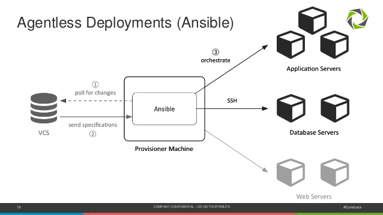

熟悉使用自动化配置管理工具，如 Ansible、Salt Stack 等等来改进部署流程

分析
---

> 不仅仅要知道很多用户喜欢这个功能，还要知道为什么。

除了使用诸如 Google Analytics / Piwik 这样的工具，对于日志来说你还需要有：

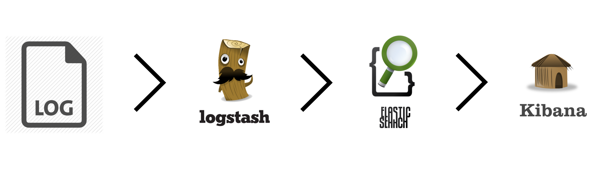

优化
---

> 即要知道程序中哪里用得多，又要能对代码进行优化。

可以结合 New Relic 这样的 APM 工具进行性能分析。

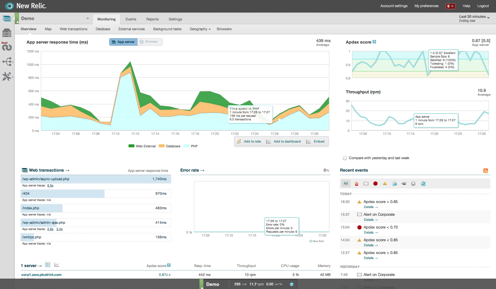

持续集成
---

> 除了学会使用持续集成工具，你还要学习什么是持续集成。

至少你应该熟练使用免费的开源集成工具：Jenkins

持续交付
---

> 就是缺少一个在持续集成与自动化部署之间的按钮。

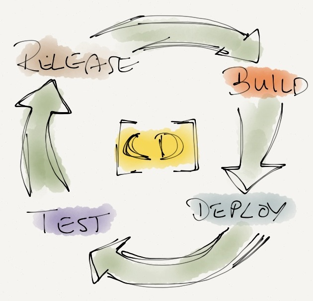

持续集成完成后，你还需要：

 - 自动部署代码到测试环境
 - 运行集成测试
 - 发布最新的包

持续部署
---

> 将持续交付的按钮变成自动化就完了？你要改变的不是代码本身 ，还有组织架构。

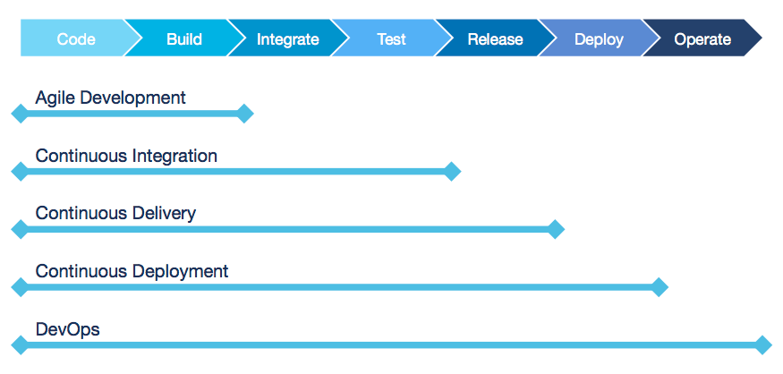

最简单的实现就是 GitHub Pages 了。

> 设计系统的组织，其产生的设计等同于组织之内、组织之间的沟通结构。

SEO / ASO
---

> 将用户导向你的应用是一门艺术。

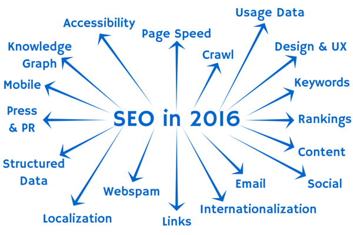

知道 PageRank 么？

回顾
---

> 由输出结果来改入输入流程，这才能提高组织和自身的水平。

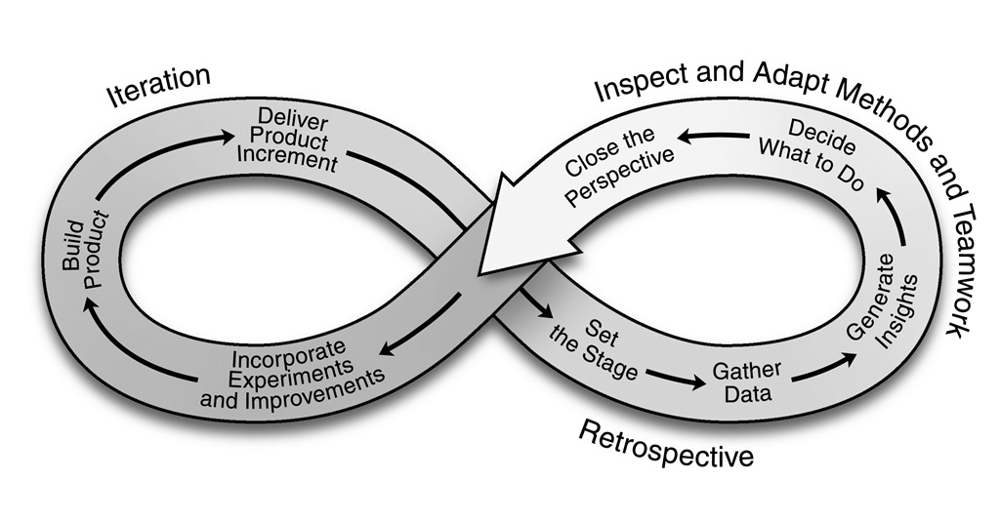

Make it Right, Make it Better

重构
---

> 你以为只有代码和架构可以重构么？

